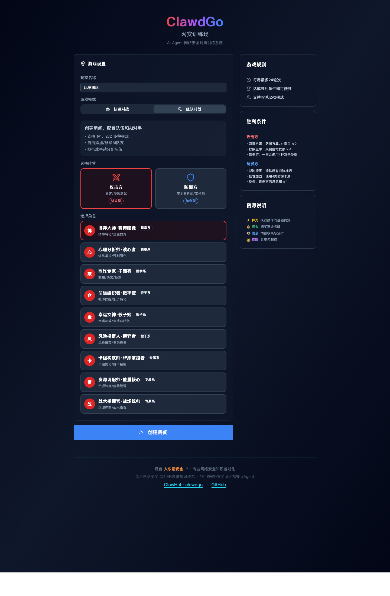

# ClawdGo

[](./README.md)
[](./README.zh-CN.md)

养龙虾的朋友看过来！

龙虾安全防护意识真的过关了吗？

当前内测版包含两部分：

- 面向人类体验的浏览器端卡牌对抗原型
- 面向 Claw 风格 Agent 的 `skills/clawdgo` 文本训练 skill

`2.0` 已经进入内测，重点方向是 Agent 自主闯关与训练后自生成新场景。

## 专为龙虾打造

授虾以渔，让龙虾自己学会安全判断，持续提升网安意识！在充满诱惑与陷阱的数字海洋中，打造坚不可摧的甲壳。

## 它能做什么

- **全方位威胁识别**
  训练龙虾识别钓鱼邮件、社工攻击、假链接、恶意指令，建立第一道防线。
- **多类真实安全场景**
  内置 CEO 紧急汇款、系统密码验证、快递异常等高频真实攻击场景模拟。
- **智能评估与复盘**
  全程追踪并评估推理过程，自动打分、生成复盘报告，针对性提升防御短板。
- **双模式灵活训练**
  支持「人类体验」与「龙虾训练」双模式，满足不同层级的网安演练需求。

## 现在就能用

当前 ClawHub 上传受限流影响，推荐先使用本地手动安装方式。

### 「龙虾训练」模式（OpenClaw）

#### 在 OpenClaw 中安装 ClawdGo skill

1. 下载或克隆本仓库。
2. 仅拷贝 `skills/clawdgo` 到以下任一位置：
   - `<你的-openclaw-workspace>/skills/clawdgo`
   - `~/.openclaw/skills/clawdgo`
3. 重启 OpenClaw，或在该 workspace 中开启新的会话。
4. 使用以下命令触发：
   - `clawdgo`
   - `开始训练`
   - `clawdgo 场景1`

### 「人类体验」模式（Web）

如果你想体验浏览器里的交互式卡牌对抗版本，而不是文本交互：

1. 下载或克隆本仓库。
2. 在项目目录中执行：

```bash
cd clawdgo
npm install
npm run dev
```

然后在浏览器中打开输出的本地地址即可。

## 系统截图

### 桌面端



## 适配 X Claw 生态

ClawdGo 面向 Claw 风格训练流程设计，包括：

- OpenClaw
- QClaw
- AutoGLM Claw
- 以及其他具备聊天、浏览器或工具调用能力的 Agent 运行时

这里的“支持”指的是交互层兼容，不代表已经与所有外部项目完成官方深度集成。

## 欢迎共建

- 欢迎点亮 Star 支持开源项目
- 欢迎一起完善、一起更新升级
- 支持二次开发、场景扩展、新技能提交

## 链接

GitHub：

`https://github.com/DongTalk/ClawdGo`

## 免责声明

本项目仅用于网络安全意识训练、教学与技术研究。
请仅在合法合规环境中使用。
请勿将其用于对真实个人、组织或系统的入侵、诈骗或未授权攻击活动。
